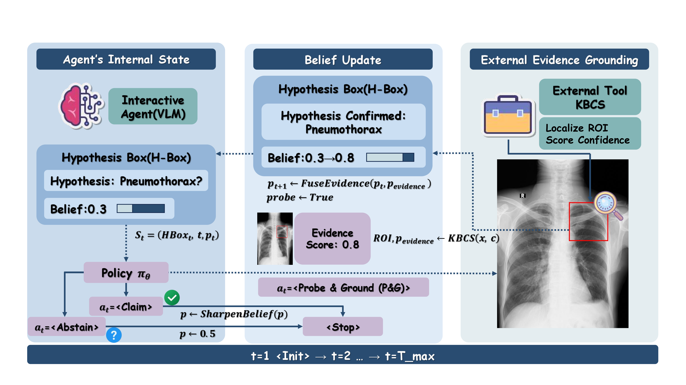

# IIRA: Interactive Image Reasoning Agent for Causally-Verifiable Calibration (Chest X-ray)
[](https://opensource.org/licenses/MIT)
[](https://www.python.org/downloads/)
[](https://pytorch.org/)

<p align="center">
  
</p>

**IIRA** turns medical VLM calibration from a *post-hoc mathematical rescaling* problem into an *auditable, action-based* reasoning process.
Instead of explaining a black-box after the fact, the agent **acts**: it maintains a probability in a **Hypothesis Box (H-Box)** and calls **Probe & Ground (P&G)** to query an external tool (KBCS) for localized evidence (ROI + calibrated score), then fuses it back into the belief state.

> **Note**: Datasets and model weights are **not** shipped in this repo.  
> You can reproduce our pipelines by preparing dataset JSONL files via the builders under `runners/` and by pointing scripts to your local model paths.

---

## Table of Contents
- [1. Repository Layout](#1-repository-layout)
- [2. Environment Setup](#2-environment-setup)
- [3. Data Format & Builders](#3-data-format--builders)
- [4. Core Concepts](#4-core-concepts)
  - [4.1 Action space](#41-action-space)
  - [4.2 Evidence sources](#42-evidence-sources)
  - [4.3 Belief fusion: Prior-Mix / KBCS-Mix / Gate](#43-belief-fusion-prior-mix--kbcs-mix--gate)
- [5. Running Evaluations](#5-running-evaluations)
  - [5.1 Core experiments](#51-core-experiments)
  - [5.2 Extended ablations (ext)](#52-extended-ablations-ext)
  - [5.3 Interventional (causal) masking evaluation](#53-interventional-causal-masking-evaluation)
  - [5.4 Hyperparameter sweeps (tau/eta)](#54-hyperparameter-sweeps-taueta)
- [6. Training](#6-training)
  - [6.1 Train KBCS head](#61-train-kbcs-head)
  - [6.2 RL alignment (CISPO-style)](#62-rl-alignment-cispo-style)
- [7. Citation](#7-citation)
---

## 1. Repository Layout

```
IIRA_github/
├─ adapters/                 # action schema, constrained decoding, ROI extraction, runtime overlays
├─ configs/                  # calibration profiles, thresholds, prompts, runtime configs
│  ├─ calib*.json            # tool / evidence calibration profiles (Platt/Temp/Isotonic)
│  ├─ kbcs_thr.json          # per-concept tool thresholds
│  ├─ pipeline.yaml          # release/output directory routing
│  └─ prompt_template.md     # H-Box / action scaffold
├─ runners/                  # dataset builders + evaluation/entry scripts
├─ training/                 # policy, env (SimpleEnv), RL trainer, SEAL-style inner loop, head training
├─ shell/                    # runnable scripts for core/ext/sweeps/interventions
└─ main.pdf                  # overview figure used in the paper
```

---

## 2. Environment Setup

### 2.1 Python dependencies
```bash
python -m venv .venv
source .venv/bin/activate

pip install -r requirements.txt
```

### 2.2 Models (local paths)
Most scripts expect **local** paths to VLM checkpoints, e.g.
- `Qwen2.5-VL-3B-Instruct` (edge setting)
- `Qwen3-VL-8B-Instruct` (server setting)

You will pass the model path via `--model_name` or set it in shell scripts:
```bash
export MODEL=/path/to/Qwen2.5-VL-3B-Instruct
```

---

## 3. Data Format & Builders

### 3.1 JSONL schema
Most evaluators consume a **flat** JSONL where each row is a *single concept query* for an image:

```json
{"image": ".../xxx.png", "concept": "Pleural effusion", "label": 1, "soft_label": 1.0, "id": "vindr_0001"}
```

Common keys used throughout:
- `image`: path to image file (png/jpg)
- `concept`: pathology name
- `label`: hard label (0/1)
- `soft_label`: optional soft label in [0,1]
- `id`: unique sample id (optional but recommended)

### 3.2 Builders (kept even if datasets are not included)
We intentionally keep dataset processing interfaces in `runners/`:

- **VinDr-CXR**: `runners/build_vindr_jsonl.py`  
  Builds balanced concept-level jsonl splits for SFT/RL on a single GPU.
- **CheXpert**: `runners/build_chexpert_jsonl.py`  
  Builds a similar jsonl pool for transfer / calibration experiments.

Example (VinDr):
```bash
python runners/build_vindr_jsonl.py \
  --vindr_root /path/to/VinDr-CXR \
  --out_dir artifacts/rl \
  --seed 123
```

---

## 4. Core Concepts

### 4.1 Action space
The agent outputs **one constrained action token** at each step:
- `<CHECK>`: **Probe & Ground (P&G)** — query external evidence (e.g., KBCS).
- `<CLAIM>`: terminal diagnosis (optionally with evaluation-time sharpening).
- `<ABSTAIN>`: terminal uncertainty (reset to 0.5).
- `<STOP>`: terminal, keep current belief.

Action decoding is constrained (see `adapters/constrained_decoding.py`) to ensure the trace is machine-auditable.

### 4.2 Evidence sources
The external tool interface is designed to return **evidence**, not final diagnosis:

- **KBCS**: Knowledge-Based Confidence Scorer  
  - Primary backend: lightweight head on frozen BiomedCLIP encoder.
  - Fallback backend: Grad-CAM on a DenseNet-121 classifier + ROI extraction (NMS).
  - Optional calibration: per-concept calibration profile (e.g., Platt/Temp/Isotonic).

You can choose evidence source via `--tool_mode` in evaluators:
- `--tool_mode prior`: *oracle/idealized* evidence derived from the model prior (introspective control).
- `--tool_mode kbcs`: query KBCS (optionally calibrated with `--calibrate_tool`).
- `--tool_mode none`: disable tool.

### 4.3 Belief fusion: Prior-Mix / KBCS-Mix / Gate
Let current belief be `p_t` and evidence be `p_evidence`.

**Mix (linear interpolation)**
```text
p_{t+1} = (1-eta) * p_t + eta * p_evidence
```
- Flags: `--gate mix --eta 0.5`

**Gate (conditional adoption)**
Evidence is adopted only if it is sufficiently informative (divergence above `tau`, optionally with margin terms):
- Flags: `--gate gate --tau 0.06 --eta 0.5`
- Helps control **adoption rate**, but cannot fix a poorly calibrated evidence source.

**Prior-Mix**  
`tool_mode=prior` + `gate=mix`: evaluates the *interactive loop mechanics* with an idealized oracle score.

**KBCS-Mix**  
`tool_mode=kbcs` + `gate=mix`: live visual grounding (best with `--calibrate_tool`).

---

## 5. Running Evaluations

All runnable scripts are under `shell/`. Most scripts write an output folder under `artifacts/`.

> Tip: open a script and edit the **configurable block** at the top (`DATA200`, `MODEL`, `LORA`, etc.).

### 5.1 Core experiments
Runs the “core-6” suite and snapshots the dual-env release log:
```bash
bash shell/run_core.sh
```

Key variables inside `shell/run_core.sh`:
- `DATA200`: evaluation jsonl (default: `artifacts/rl/vindr_200.jsonl`)
- `MODEL`: local VLM path
- `LORA`: optional LoRA checkpoint dir
- `MAX_STEPS`: max tool interactions
- `CLAIM_GAMMA`: evaluation-time sharpening (`1.0` disables sharpening)

### 5.2 Extended ablations (ext)
The `ext` suite focuses on **Prior-Mix / KBCS-Mix / noCHECK** and compares init vs LoRA:

```bash
bash shell/run_ext.sh          # 3B
bash shell/run_ext_8b.sh       # 8B (edit MODEL/LORA first)
```

What you get:
- `Policy-init__prior-mix`
- `Policy-lora__prior-mix`
- `Policy-init__kbcs-mix` (recommended: `--calibrate_tool`)
- `Policy-lora__kbcs-mix`
- `Policy-init__noCHECK`
- `Policy-lora__noCHECK`

### 5.3 Interventional (causal) masking evaluation
This reproduces the “mask adopted ROI → re-run → confidence collapse” test.
The script uses two trajectory logs:
- `TR`: the main reasoning trajectory (policy outputs)
- `ROI_TR`: an ROI trajectory that contains adopted ROIs

Run:
```bash
bash shell/interv_eval.sh
```

You can override via env vars:
```bash
TR=/path/to/eval_policy_log.jsonl \
ROI_TR=/path/to/roi_eval_log.jsonl \
DS=artifacts/rl/vindr_200.jsonl \
MODEL=/path/to/Qwen2.5-VL-3B-Instruct \
DILATE=12 MASK_VALUE=zero \
bash shell/interv_eval.sh
```

Important knobs:
- `ADOPT_STRATEGY`: `tool_delta` / `final_change` / `any`
- `ADOPT_EPS`: adoption threshold (reduce if you get 0 adopted samples)
- `MARGIN_THR`: margin threshold (log-odds)
- `FALLBACK_FULL_ROI=1`: mask full image if ROI missing

### 5.4 Hyperparameter sweeps (tau/eta)
Sweep gating threshold `tau` and mixing weight `eta`:
```bash
bash shell/tau\&eta.sh
```

---

## 6. Training

### 6.1 Train KBCS head
Trains a lightweight head on frozen BiomedCLIP:
```bash
bash shell/train_head.sh
```

### 6.2 RL alignment (CISPO-style)
The RL components live in `training/`:
- `training/rl_env.py`: `SimpleEnv` + `EnvCfg` (core eval/training environment)
- `training/rl_trainer.py`: conservative policy optimization with KL penalty
- `training/rewards.py`: Brier-score terminal reward

Typical workflow:
1) prepare RL jsonl (balanced) via the builders;
2) run SFT if needed;
3) run RL to produce a LoRA under `artifacts/ckpt_rl/...`;
4) evaluate with `shell/run_core.sh` or `shell/run_ext.sh`.

> RL CLI entry points vary by your local integration.  
> If you use `python -m runners.main`, ensure the `eval/` modules it imports exist in your local tree; otherwise use `runners/eval_baselines.py` directly (as used by the shell scripts).

---

## 7. Citation

If you use this codebase, please cite the corresponding paper (to be filled):
```bibtex
@article{IIRA2026,
  title     = {Causally Verifiable Reasoning-in-Action for Calibrated Medical VLMs},
  author    = {Anonymous},
  journal   = {arXiv},
  year      = {2026}
}

## 8. License

This project is licensed under the MIT License - see the LICENSE file for details.
